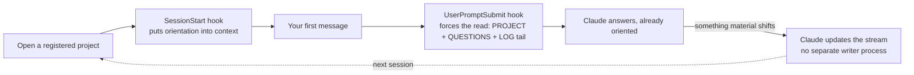

# Permanence

> Created by **Steven Loftus** (2026) — Licensed under [GPLv3](./LICENSE)

You close the laptop, come back tomorrow, and your AI assistant remembers nothing — not the decision you made, not why you ruled out the other approach, not who's waiting on what. So you spend the first ten minutes of every session re-explaining the project to it, or you don't, and it quietly repeats a mistake you already fixed once.

**Permanence is the fix**: your externalised working memory, in plain markdown + git. It holds the state of your ongoing projects — what's happening, who's involved, what's decided, what's open — in files that survive across sessions and days, so you (and Claude) pick up exactly where you left off instead of rebuilding context every time. It's for any kind of ongoing project you run *with* an AI assistant, not just software — a client engagement, a programme you're managing, a piece of writing — anywhere you'd otherwise be the one holding all the state in your head.

**Without it** — you open a session on a project you touched last week:

> You explain it from scratch: what it's for, what's decided, who's waiting on what, the approach you already tried and ruled out. Ten minutes gone before any real work starts — and if you skip the explanation, the AI quietly repeats the mistake you already fixed once.

**With it** — you open the same session:

> Claude has already read `PROJECT.md`, the open `QUESTIONS.md`, and the tail of `LOG.md` before your first message lands. It picks straight up where you left off — the decision, the person waiting on it, the dead end you already ruled out — without you saying a word about it.

This isn't a demo. It's the author's actual daily driver, and it holds up under real weight: **14 concurrent project streams** tracked side by side — consulting work, internal programmes, personal projects — with one single stream alone carrying **11,000+ lines of chronological history across nearly 500 dated entries**, built up entirely through ordinary daily conversation with Claude, no special effort. Several streams run 100–200+ line `PEOPLE.md` files, actually applying the fact/inference discipline below to real working relationships over months, not a one-off example. This repo ships with **none of that** — just the machinery and conventions, plus a worked example in a far domain (home decorating/DIY) so you can see the shape in action without anyone's real project spilling into a public template.

---

## Install it — about 5 minutes

**The lazy way: hand your AI this repo and one instruction.** Paste both lines into Claude Code (or any AI assistant with shell access):

> `https://github.com/lotusboy/permanence`
> *"Clone this to `~/permanence`, then read its README.md and QUICKSTART.md and set Permanence up for me."*

**The manual way — three commands:**

```bash
git clone https://github.com/lotusboy/permanence.git ~/permanence
cd ~/permanence && rm -rf .git && git init && git add -A && git commit -m "My Permanence"
~/permanence/runtime/install.sh
```

Two things worth saying plainly:

- **Throwing away `.git` and re-initialising is deliberate, not a mistake.** Your Permanence fills up with your own private notes about real projects and real people. It becomes *your* repo with *your* history — not a fork of this one, and not something you'd ever push back here.
- **You can still pull future improvements after that.** `/perma-upgrade` reads the upstream URL from `runtime/.update-source`, a tracked file in the repo — it doesn't depend on the git remote you just removed.

Then follow **[QUICKSTART.md](./QUICKSTART.md)** for the rest — mainly registering your first project, which is one sentence spoken to Claude.

Nothing here phones home. It's plain markdown files and local shell scripts; the only thing that talks to a network is the optional nightly tidy, which runs your own Claude.

> **Been handed a zip rather than the link?** Same thing — unzip it, move the folder to `~/permanence`, open it in your AI assistant and say *"read README.md and QUICKSTART.md, then set this Permanence up for me."*

---

## The shape

A **stream** is one ongoing concern — a project, an area of life — in its own folder, holding a few canonical files:
- `PROJECT.md` — current state (carries a `Last updated` date)
- `LOG.md` — chronological notes, **append-only** (newest first)
- `PEOPLE.md` — who's involved + how to work with them
- `QUESTIONS.md` — open questions (close with `[CLOSED YYYY-MM-DD]`, don't delete)
- (`STRATEGY.md`, `README.md` as needed)

A folder is a stream exactly when it has a `PROJECT.md` — that's what the tooling discovers. (See `example/home/bathroom` and `example/home/kitchen`.)

**Turning a project into a stream — `/perma-register`.** Say *"register this project"* (point it at the README if there is one) and Claude creates the stream, seeds it from the README, and adds one row to `_meta/REGISTRY.md`. That's the whole setup — no manual file-wrangling. You don't even have to remember to do it: open a new, unregistered project and start doing real work, and Claude will notice and offer to register it, once — you'll never be nagged twice about the same folder.

## The four conventions (the real value)

1. **The people-rule.** Notes on people: observable behaviour + impact as *fact*; your read of *why* as a dated, provisional *inference* you revisit; conduct, never fixed character; written as if they'll read it. (The pre-commit guard nudges you if a commit's wording slips.) See `example/home/kitchen/PEOPLE.md`.
2. **Append, don't rewrite.** LOGs grow; questions close with markers, not deletion. The history is the value.
3. **One-way flow.** Permanence reads your project context; project repos never reference Permanence. Keeps private notes out of shared/published code.
4. **Gentle, accurate register.** Blunt thinking is fine in your head; what gets *written down* is rendered kindly and precisely — same meaning, safer key.

## The loops



- **Write / read — how "automatic" actually works.** No daemon watches your conversation; it's two hooks plus one instruction, every session:
  1. **SessionStart** (`session-start.sh`) fires when you open a registered project — resolves the stream from `_meta/REGISTRY.md` and puts orientation into context.
  2. **UserPromptSubmit** (`session-load.sh`) fires on your first message — this is the *reliable* trigger. A passive SessionStart note is easy for a model to skim past; this one forces the instruction onto the very message Claude is about to answer, so it actually reads `PROJECT.md` / `QUESTIONS.md` / the `LOG.md` tail before responding.
  3. **That's also where the write side comes from.** What Claude reads includes the standing rule itself — *update this stream whenever something material shifts, without being asked.* There's no separate writer process: the same model, in the same conversation, keeps the files current because it was told to and follows through, the same way it follows any other instruction you give it.

  Worth being honest about the limit: this is instruction-following, not a guarantee — nothing mechanically enforces it. `/perma-consolidate` exists partly as the safety net for exactly that gap, catching drift if an update ever gets missed.
- **Consolidate** (`/perma-consolidate` → `/perma-consolidate-review`) — a periodic tidy: catches stale PROJECTs, closes aged inferences, dedupes. See `example/.consolidation/REPORT-example.md`.
- **Orchestrate** (`/perma-orchestrate`) — finds ideas converging across streams you didn't connect. See `example/_meta/emergent.md`. (Only useful once you have a few streams — ignore it at first.)

## Why "Permanence"

It started life named after "object permanence" — the ADHD-community term for the exact failure mode this tool exists to fix: things, and people, ceasing to exist the moment they're out of sight or out of context. The author has ADHD; this tool started as the externalisation of a compensation he already needed for himself. The insight that made it worth building for anyone else: an AI assistant has the *identical* failure mode, once, every single session, by design — no memory of anything not currently in front of it. Give both of you a place outside your own head where state actually persists, and "out of sight, out of mind" stops being inevitable for either of you.

The full phrase is still the origin story; the tool itself is just called **Permanence** now — shorter, and it's the word you actually type and say to it day to day (`~/permanence`, "set Permanence up for me," `/perma-*`).

Companion project: [`axis-engineering`](https://github.com/lotusboy/axis-engineering) — the reasoning methodology this tool is built on, from the same author, born from the same neurodivergent cognitive profile.

## Optional extras (opt-in — `install.sh` prints how to switch each on; skip until you want them)

- **Events** (`/perma-emit`) — when you've two projects open, one can flag something material to the *other's* Claude (a decision, a blocker), agent-to-agent. Emitting works out of the box; *receiving* is two machine-wide hooks you enable deliberately: a **UserPromptSubmit** hook surfaces waiting messages on the other session's next prompt, and a **Stop** hook catches a message that lands *mid-turn* — right as that session would go idle — and has it read them before stopping. Both are free (a local file read; they cost a turn only when there's actually a message) and share one cursor, so each message arrives once. Pub/sub: the sender never sees its own event. *(Truly-idle wake — with no user turn at all — needs an external nudge; see SPEC.)*
- **Programme groups** (`_meta/GROUPS.md`) — for **one owner spanning several of their own repos** (e.g. related internal assets you personally work across), a group says "these repos report into that shared folder", so winding down in *any* of them refreshes one plan-and-status trail written for someone outside the work (a programme manager or director). Only the pointer lives in Permanence; the procedure lives in the target repo. **Not a substitute for team collaboration across separate laptops** — the update lock is per-clone and `members` are read via local `git log`, so it cannot coordinate two different people's machines; it needs every member repo checked out where the update runs. Run **`/perma-register-group`** to set one up: it adds the rows and scaffolds the folder from `templates/programme-task-doc.md`. The report shape and RAG rules in that template are **fixed across all groups** (versioned `REPORT SPEC v1`) so one reader can scan many programmes side by side and have each word mean the same thing; roles, phases and document names are yours to set. Leave `GROUPS.md`'s example rows alone and nothing happens — `/perma-shutdown` skips the step silently.
- **Semantic search** (`/perma-search`) — find notes by *meaning* across all streams when keyword-`grep` misses paraphrases. Local embeddings, nothing leaves the machine; the markdown stays the source of truth (it just points you at the right file).
- **Cognitive-debt scan** (`cogdebt-scan.sh`) — a weekly local check on an AI-built repo (bus-factor, AI-authored %, doc-to-code, biggest file); when something crosses a line it *emits an event* so you're nudged to act. No model/API.

These are deliberately off by default — the core (streams + the loops above) is the whole point; reach for these when you feel the specific need.

## What's in here

| Path | What it is |
|---|---|
| `runtime/` | the machinery — `session-start.sh` (loads the right context per workspace), `generate-contents.sh`, `install.sh`, `nightly-consolidate.sh`, `schedule-task.sh` (cross-platform scheduling), `claude-md-block.md` + `agents-md-block.md`, and `commands/` (the `/perma-*` commands: help, brief, startup, shutdown, consolidate, consolidate-review, contents, orchestrate, register, register-group, upgrade). **Opt-in extras** (install prints how): cross-project **events** (`/perma-emit`), local semantic **search** (`/perma-search`, `runtime/search/`), and a weekly **cognitive-debt scan** (`cogdebt-scan.sh`). |
| `.githooks/` | a **people-rule pre-commit guard** + a post-commit inventory refresh |
| `SPEC.md` | the system, harness-independently — data model, invariants, runtime contract |
| `docs/` | [`UPGRADE.md`](./docs/UPGRADE.md) (the `/perma-upgrade` walkthrough) and [`OTHER-TOOLS.md`](./docs/OTHER-TOOLS.md) (using Permanence with something other than Claude Code) |
| `templates/` | blank skeletons for the canonical files |
| `example/` | a **fictional** populated Permanence (home decorating/DIY) showing the shape + each mechanism in action. **Delete `example/` once your own streams are going.** |
| `_meta/REGISTRY.md` | maps each of your project folders → Permanence stream it should load (you fill this in) |

> New here, or forgotten what's available? **`/perma-help`** lists every command and shows which background pieces are actually switched on for your machine.

## Staying current

The machinery improves over time. To pull the latest **without** disturbing your own streams or notes, run **`/perma-upgrade`** any time — `runtime/.update-source` is already pointed at the public template on a fresh clone, so there's no setup step unless you're on a private fork (in which case, point it at that instead). It shows you what's changing before anything happens, negotiates any file you've customized that the release also touched, and proposes (never silently applies) anything from `CHANGELOG.md` that might affect your own streams — see [docs/UPGRADE.md](./docs/UPGRADE.md) for the full walkthrough. Everything lands as a normal, revertable commit in your Permanence's own history.

## Get going

Install commands are at the [top of this page](#install-it--about-5-minutes); the walkthrough is **[QUICKSTART.md](./QUICKSTART.md)**.

> Fully automated on **Claude Code** (the `/perma-*` commands, the SessionStart hook); works with other AI tools too (Devin, Google Antigravity, Cursor, and anything reading the `AGENTS.md` standard), automated where the tool supports a global config file, manual otherwise — see [docs/OTHER-TOOLS.md](./docs/OTHER-TOOLS.md). Using something without hooks at all, like plain Claude Desktop or a chat interface? The manual pointer in that doc still works — just not hands-off. `SPEC.md` separates the harness-independent contract from any binding. Built on the **axis-engineering** methodology (a separate, public companion — optional).

## License

Copyright (C) 2026 Steven Loftus. Licensed under the [GNU General Public License v3.0](./LICENSE) — free to use, modify, and distribute, including commercially; a distributed modified version must stay open under the same terms.
